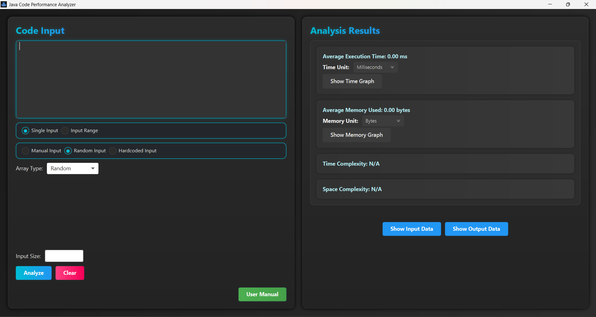
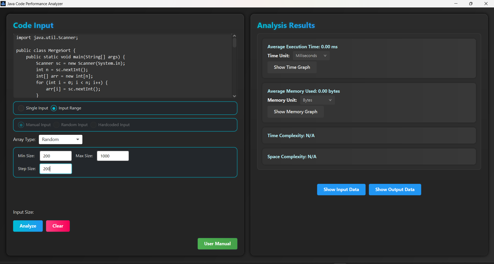
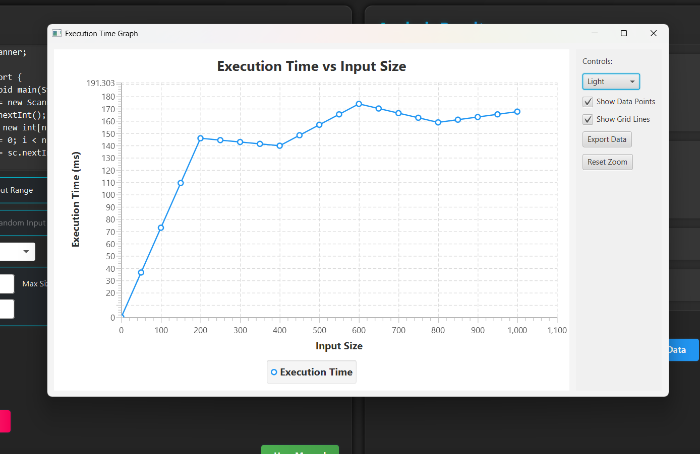
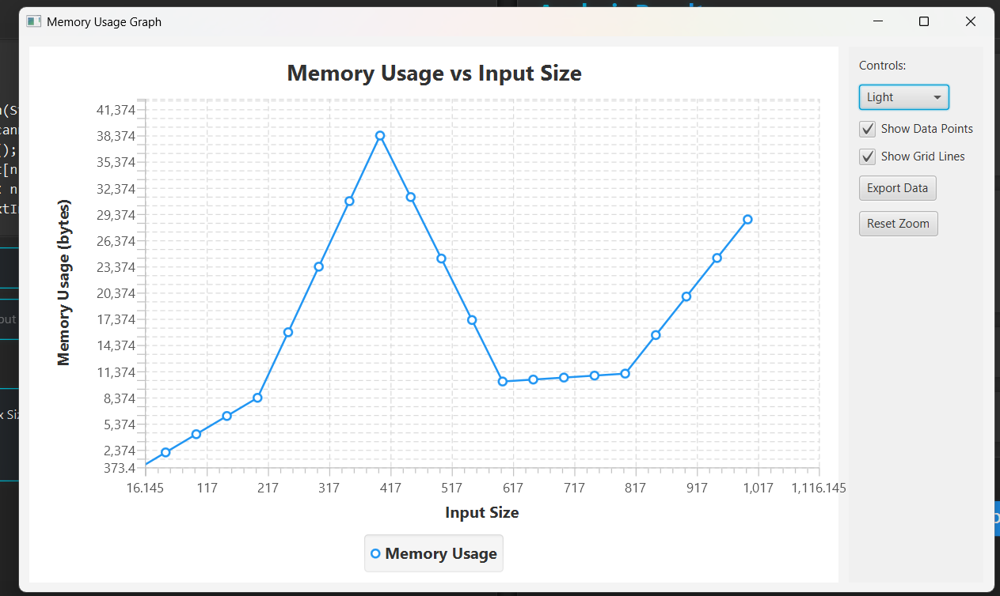
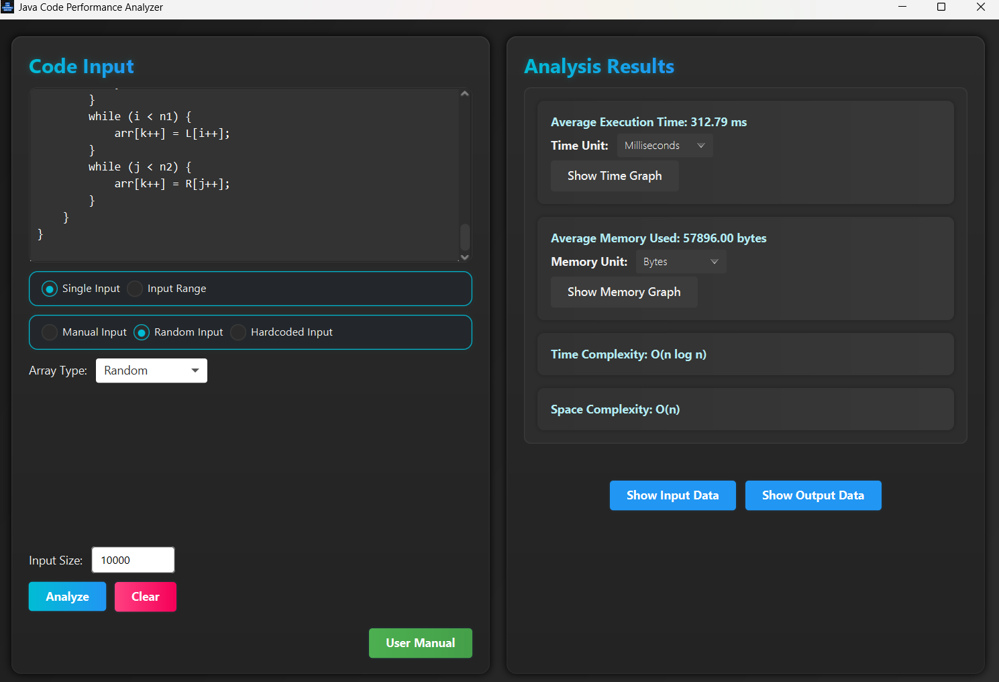
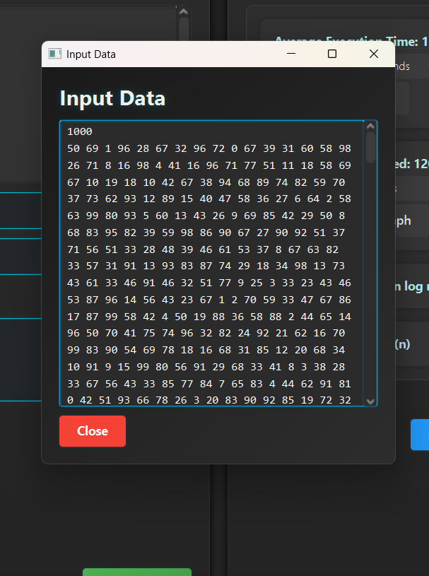
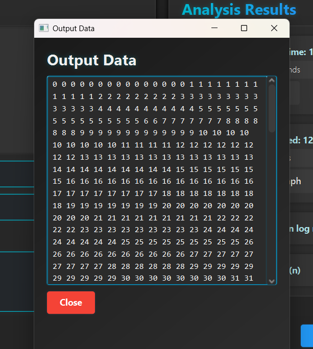
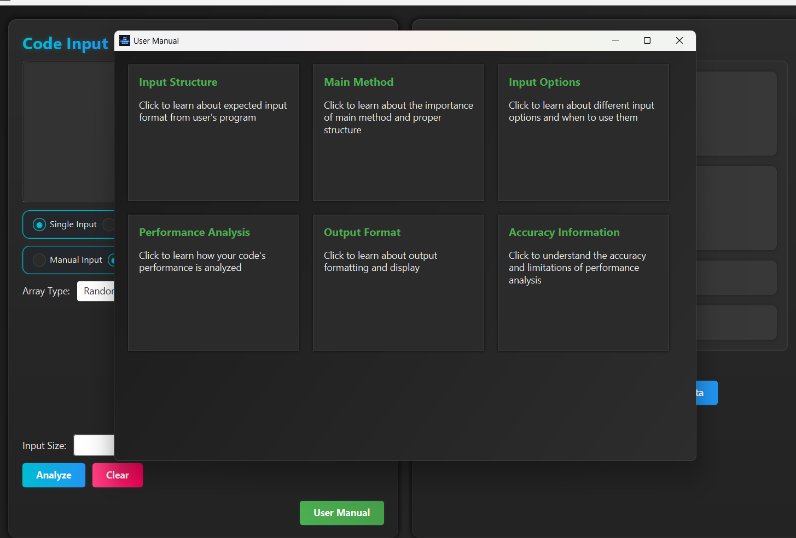

# Java Code Performance Analyzer Tool

A sophisticated desktop application that analyzes Java code performance metrics, including execution time and Memory usage. Features automated test data generation with customizable input sizes up to 100,000 elements, eliminating the need for manual test data creation.

## Table of Contents

- [Overview](#overview)
- [Main User Interface](#main-user-interface)
- [Input Types](#input-types)
  - [Single Input](#single-input)
  - [Range Input](#range-input)
  - [Manual Input](#manual-input)
  - [Random Input](#random-input)
  - [Hardcoded Input](#hardcoded-input)
- [Graphs and Visualizations](#graphs-and-visualizations)
  - [Execution Time Graph](#execution-time-graph)
  - [Memory Usage Graph](#memory-usage-graph)
  - [Combined Execution Time & Memory Usage Results](#combined-execution-time--memory-usage-results)
- [Data Display](#data-display)
  - [Input Data](#input-data)
  - [Output Data](#output-data)
- [User Manual](#user-manual)
- [Installation](#installation)
- [Usage](#usage)

## Overview

The Java Code Performance Analyzer Tool uses Java and JavaFX to evaluate code efficiency. It generates performance graphs from various input types and displays key metrics such as execution time and memory usage.

## Main User Interface

The main UI features:
- **Code Input Panel:** Paste or write code to be analyzed.
- **Input Options:** Select input type and adjust parameters.
- **Results Panel:** View performance metrics including execution time, memory usage, time and space complexity.
- **Graph Buttons:** Launch dedicated graph windows for further analysis.



## Input Types

The tool provides several input methods:



### Single Input
Provide a single dataset to test your program quickly.

### Range Input
Specify a range with:
- **Minimum Input Size**
- **Maximum Input Size**
- **Step Size**

### Manual Input
Enter custom test cases directly.

### Random Input
Generate random test data automatically based on your configuration.

### Hardcoded Input
Uses predefined test data embedded in the code for consistent benchmarking.

## Graphs and Visualizations

Visualizations help you interpret performance trends:

### Execution Time Graph
Displays the program's execution time across different input sizes.



### Memory Usage Graph
Visualizes the memory usage trend.



### Combined Execution Time & Memory Usage Results
A summary view of execution time and memory usage.



## Data Display

### Input Data
View the test data used for analysis in a dedicated window.



### Output Data
Review your program's output after analysis.



## User Manual

Detailed usage instructions and guidelines can be found in the integrated user manual. The manual explains:
- Expected input format
- Main method requirements
- Performance analysis techniques
- Best practices for accurate results



## Installation

1. **Clone the Repository:**

   ```sh
   git clone https://github.com/neeraj1240/JavaCodePerformanceAnalyzer.git
   ```

2. **Navigate to the Project Directory:**

   ```sh
   cd JavaCodePerformanceAnalyzer
   ```

3. **Build the Project:**

   If using Maven (as indicated by the `pom.xml` file), run:

   ```sh
   mvn clean install
   ```

4. **Run the Application:**

   If you are using the command line:

   ```sh
   java -cp target/your-artifact.jar main.ui.CodeAnalyzerUI
   ```

   Alternatively, you can run the application from within your IDE (e.g., Visual Studio Code).

## Usage

1. **Enter Code:**
   - Use the left panel to type or paste your Java code.
  
2. **Select Input Type:**
   - Choose from Single, Range, Manual, Random, or Hardcoded inputs.

3. **Start Analysis:**
   - Click "Analyze" to run the performance metrics.
  
4. **View Graphs and Results:**
   - Use "Show Time Graph" and "Show Memory Graph" buttons to view detailed visualizations.
   - Review the numeric results displayed alongside the graphs.

5. **Use the User Manual:**
   - Access the user manual directly from the UI for further guidance.
