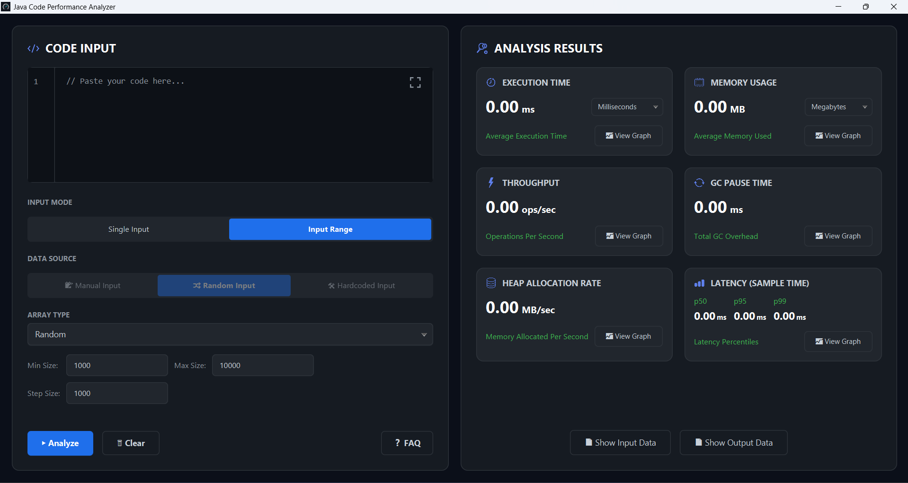
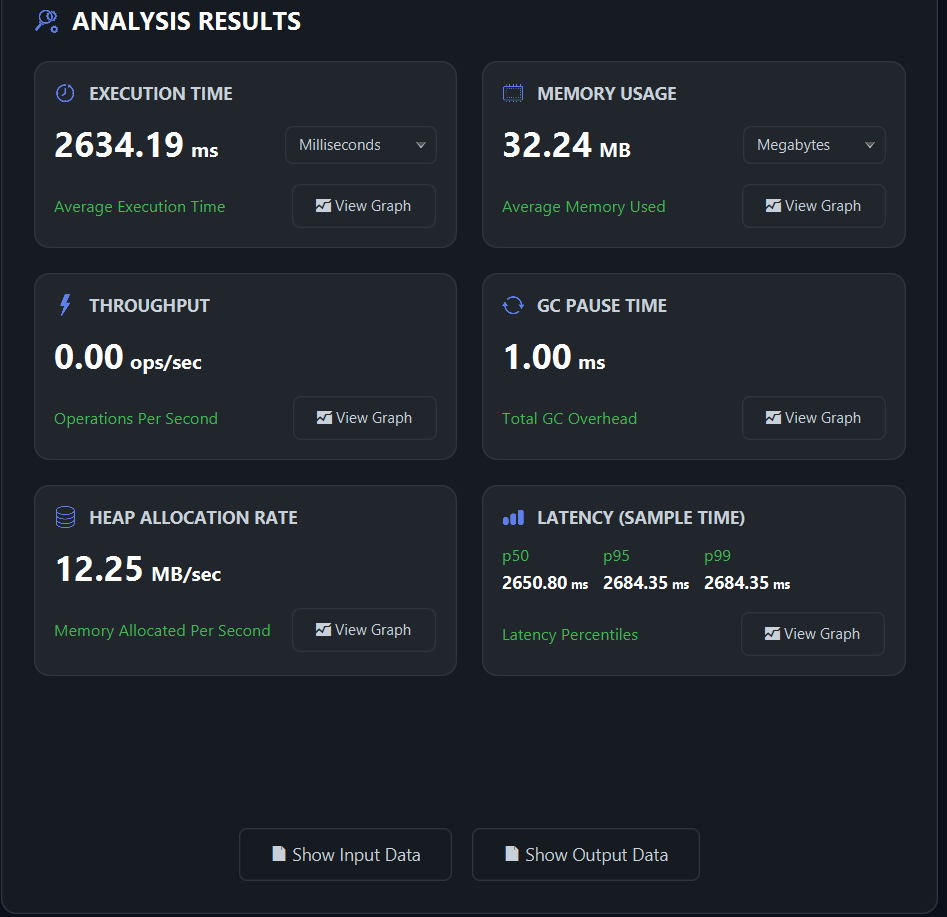
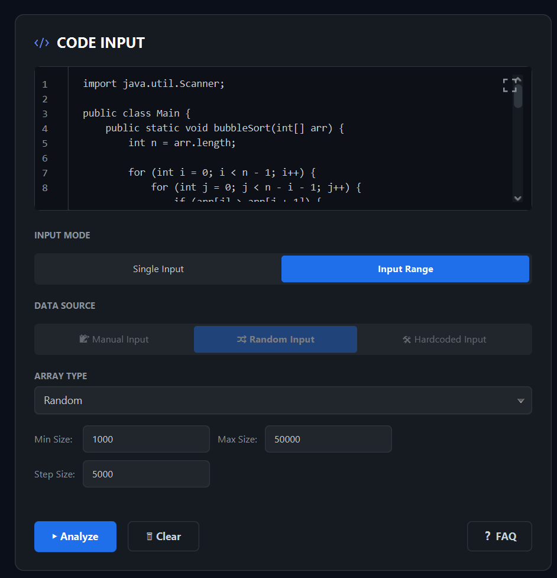
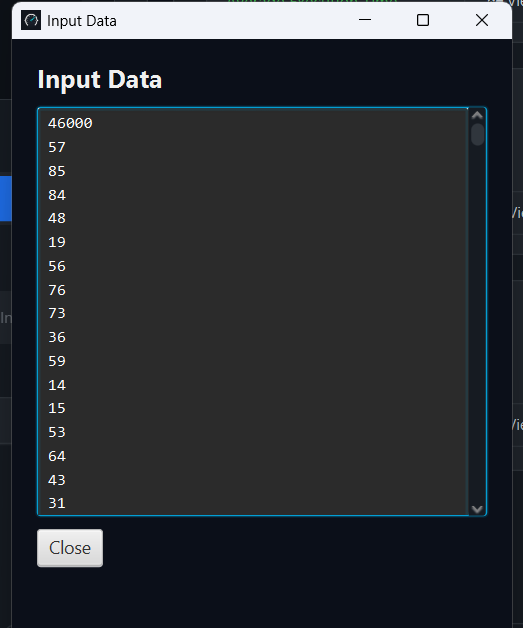
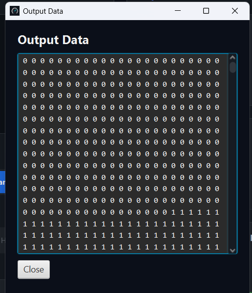
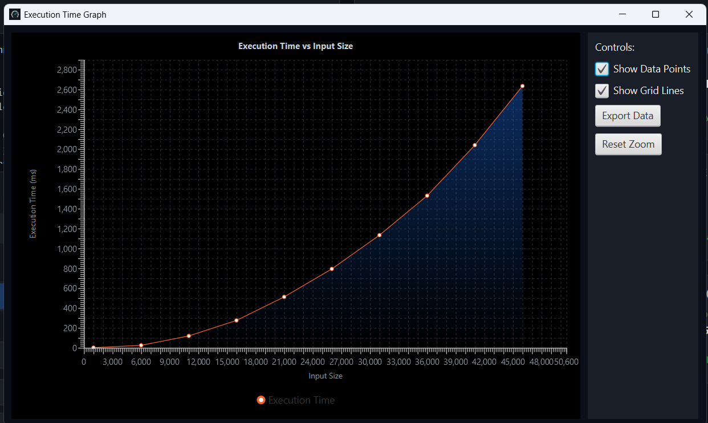
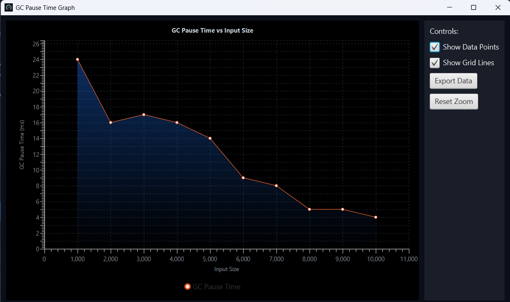
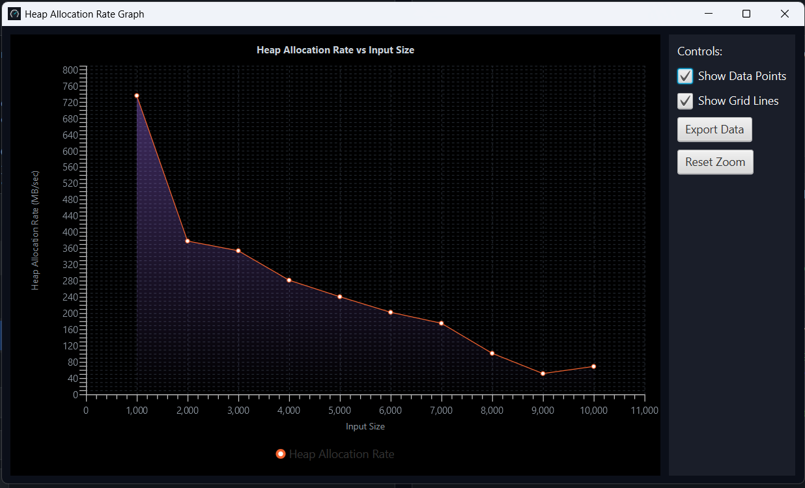
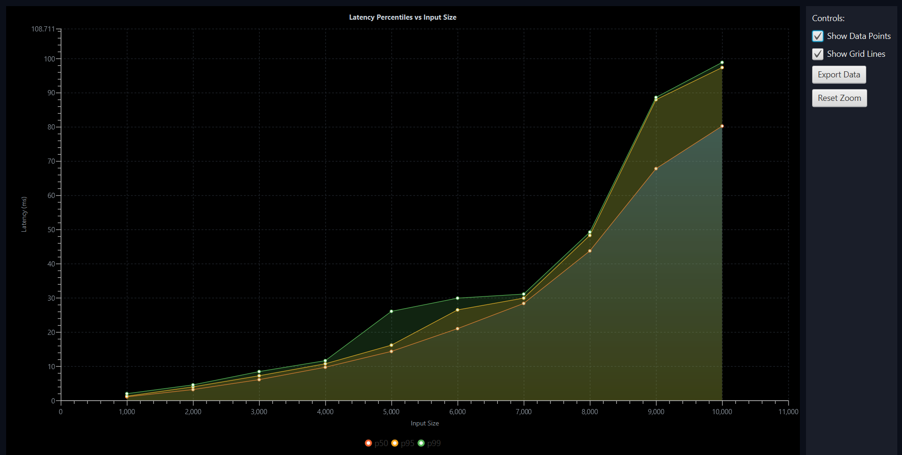
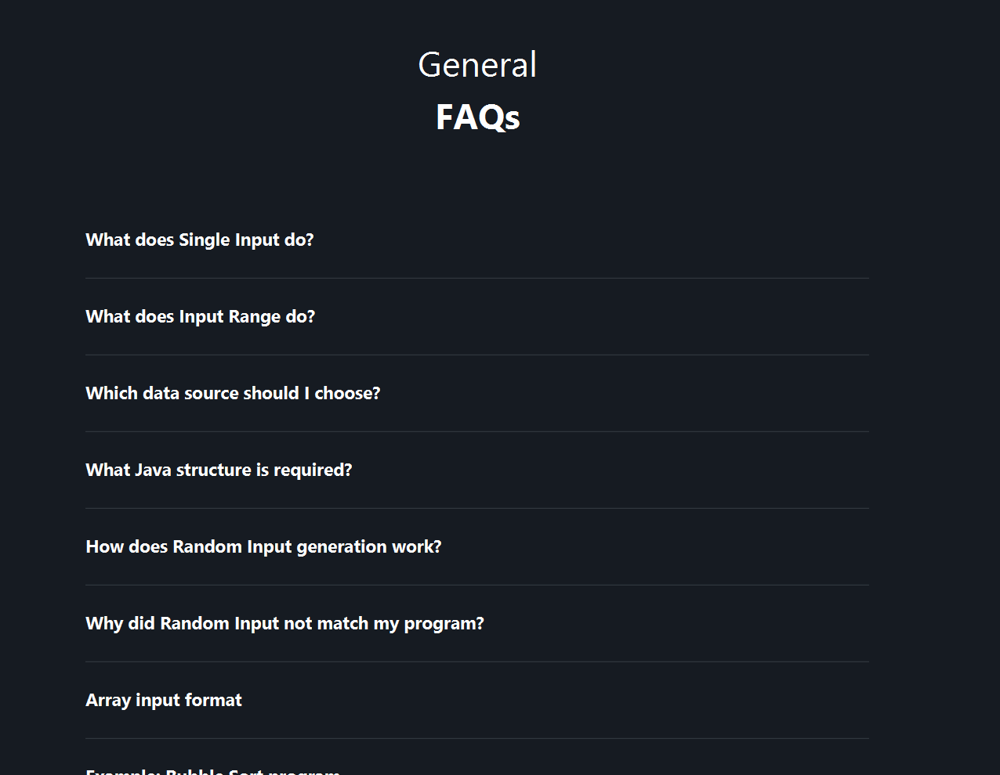

# AnalyzePrograms

JavaFX desktop app for benchmarking small Java programs.

Paste Java code, choose input, run it, and inspect the numbers. The app compiles the pasted code with `javac`, runs it once to capture output, then benchmarks the program's `main` method with JMH.

It does not prove Big-O. It gives measurements so you can compare how the same program behaves as input grows.

## What It Measures

- Execution time.
- Memory usage.
- Throughput: operations per second.
- GC pause time.
- Heap allocation rate.
- Latency percentiles: p50, p95, and p99.

## Code Requirements

The pasted program should:

- Use a `public class`.
- Use `public static void main(String[] args)`.
- Avoid a `package` declaration. The runner expects the public class directly on the temporary classpath.
- Print something with `System.out.print`, `System.out.println`, `System.out.printf`, or the same methods on `System.err`. The UI uses this to make output capture explicit.

The app is best for self-contained algorithm snippets, not full projects with build tools, external libraries, files, networking, or long-running services.

## Input Modes

### Single Input

Runs one benchmark point.

Data sources:

- Manual Input: paste the exact stdin your program expects.
- Random Input: generate stdin from simple `Scanner` patterns.
- Hardcoded Input: use data already inside the code. This mode rejects code that still reads from `Scanner`.

### Input Range

Runs the same program across multiple generated input sizes. This is the mode that enables graphs.

You provide:

- Min size.
- Max size.
- Step size.
- Array type: random, sorted, or nearly sorted.

The max generated size is `100000` (FOR NOW).

### Random Input Rules

Random generation is heuristic. It handles simple `Scanner` programs, including:

- `nextInt()` / `nextDouble()` numeric input.
- Common array-style input where the first number is the size.
- Simple matrix input.
- Single `nextLine()` string input.

For custom formats, use Manual Input. Do not fight the generator.

## Input And Output Windows

The app stores the exact input used for the latest run and the output captured from the verification run.

## Graphs

Graphs are only available after Input Range analysis, because one input size is not a trend.

Each graph window can show/hide data points, show/hide grid lines, export CSV data, reset zoom, pan, and zoom.

## FAQ Window

The in-app FAQ explains the supported input formats and common failure cases.

